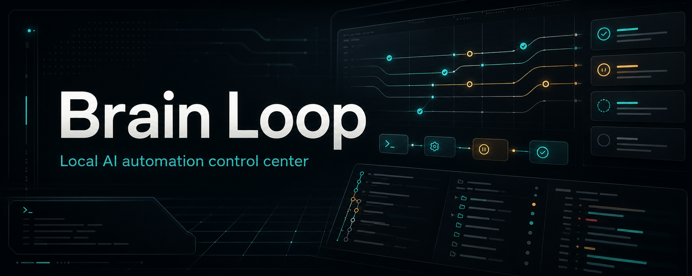

# Brain Loop

Brain Loop is an opinionated, local-first macOS desktop app for controlling Brain automation. It gives developers a Codex-style control surface for implementation and review agents while keeping queue state, project memory, approvals, logs, transcripts, and worktrees inspectable on disk.

The project is intentionally narrow: Brain Loop is not a hosted automation platform or a generic workflow dashboard. It is built around Brain queue contracts, explicit runner boundaries, durable local state, and user-controlled approvals.

## What It Does

- Shows Brain implementation and review queues in a local desktop console.
- Runs supported automation tools as configurable runners.
- Keeps implementation and review work in separate capacity pools.
- Uses isolated per-task worktrees by default.
- Streams runner output into visible UI surfaces and durable logs.
- Tracks thread metadata, artifacts, approvals, and transcripts.
- Provides explicit approval, deny, expire, pause, and inspection points for sensitive work.

Supported runner ids currently include `open-code`, `antigravity`, and `codex`. Runner/model defaults are configurable through settings.

## Local State Model

Brain Loop treats `~/.brain-loop` as the durable source of truth:

```text
~/.brain-loop/
  settings.toml
  projects.json
  approvals.json
  queues/
    handoffs/
    archive/
  orchestrations/
  threads/
  worktrees/
  locks/
  logs/
```

Global settings live in TOML. Queue items, projects, approvals, threads, locks, workspace metadata, and run metadata remain JSON for compatibility with Brain automation skills.

Legacy state under `~/.codex/brain-project-manager` can be copied into `~/.brain-loop` when the new root is first prepared. Existing Git worktrees are not moved automatically.

## Repository

```text
apps/desktop              Tauri v2 desktop app and React control console
packages/brain-core       Shared Brain state schemas, constants, and examples
packages/desktop-client   Typed frontend wrappers for Tauri commands/events
brain/                    Project memory, architecture notes, tasks, and decisions
```

## Tech Stack

- Bun workspace and package manager
- Turborepo task orchestration
- Tauri v2
- Rust native orchestration core
- React, Vite, and TypeScript
- xterm.js-backed terminal surfaces

## Prerequisites

- macOS
- Bun `1.2.0` or newer
- Rust and Cargo for Tauri development and release builds
- Local runner CLIs for the automation tools you want to use

Rust is required for `tauri:dev`, `tauri:build`, and Rust validation. If Cargo is unavailable, TypeScript checks can still run, but native desktop validation will be blocked.

## Getting Started

Install dependencies:

```bash
bun install
```

Start the desktop app:

```bash
bun --filter @brain-loop/desktop tauri:dev
```

You can also use the root script:

```bash
bun run dev
```

## Useful Commands

```bash
bun run typecheck
bun run build
bun --filter @brain-loop/desktop build
bun --filter @brain-loop/desktop rust:check
bun --filter @brain-loop/desktop visual:qa
bun --filter @brain-loop/desktop scheduler:qa
bun --filter @brain-loop/desktop tauri:build
```

## Product Principles

- Queue items are the automation contract.
- Runs should be traceable to queue state, runner settings, worktrees, logs, and transcripts.
- Sensitive actions should pass through the approval broker.
- Local files remain the source of truth.
- Runners should not hide output or invent unsupported queue transitions.
- The UI favors a dense, dark, thread-oriented control surface over broad dashboard navigation.

## Current Status

Brain Loop is under active development. The current work focuses on the desktop orchestration surface, Brain state compatibility, runner/model configuration, worktree-backed agent threads, queue dashboards, approvals, logs, scheduler controls, and release-readiness checks.

V1 does not aim to support hosted state sync, organization accounts, generic workflow automation, silent destructive runner actions, or automatic deletion of worktrees, logs, queue items, or artifacts.

## Contributing Notes

Brain documentation is part of the project contract. Before meaningful code changes, read the relevant files under `brain/`, starting with:

- `brain/BRAIN.md`
- `brain/SYSTEM_OVERVIEW.md`
- `brain/system/overview.md`
- `brain/system/architecture.md`
- `brain/engineering/ai-rules.md`
- `brain/engineering/coding-standards.md`
- `brain/tasks/in-progress.md`

After changes, update Brain docs when behavior, architecture, API contracts, permissions, database shape, feature behavior, or task state changes. If no Brain update is needed, say so explicitly in the change summary.

## Release Verification

Before packaging a release, run:

```bash
bun run typecheck
bun --filter @brain-loop/desktop build
bun --filter @brain-loop/desktop visual:qa
bun --filter @brain-loop/desktop tauri:build
```

Manual smoke checks should cover empty Brain state, sample queue rendering, runner spawn failures, successful logs, review-ready transitions, approval decisions, scheduler pause behavior, notification preferences, and reversible LaunchAgent controls.
